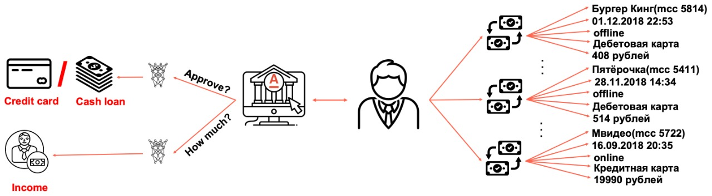
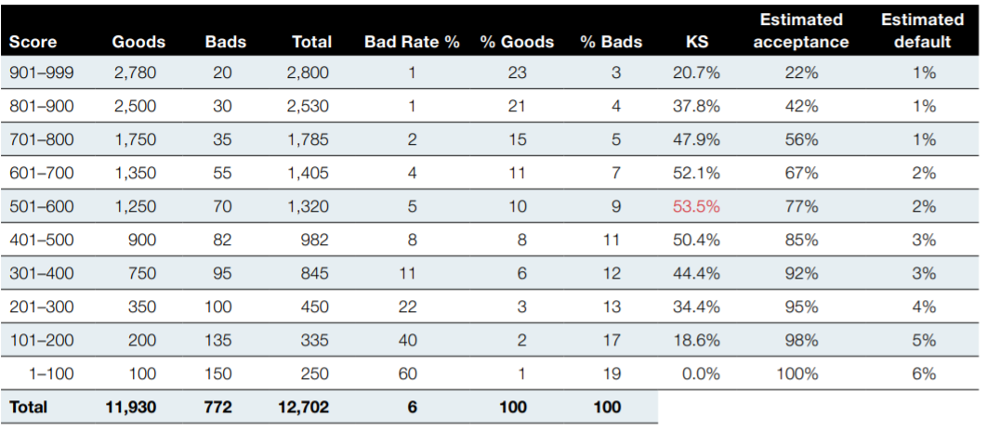
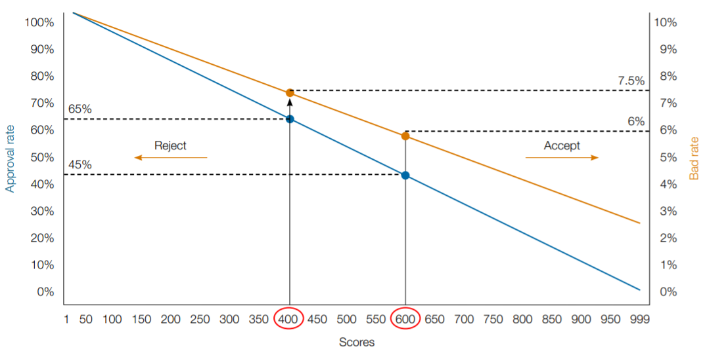
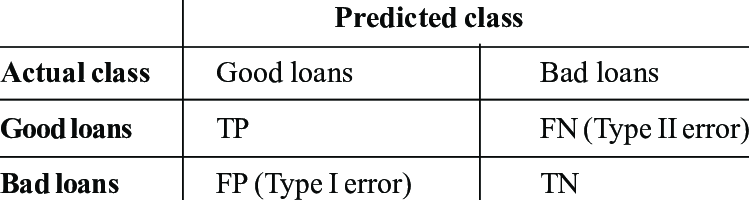
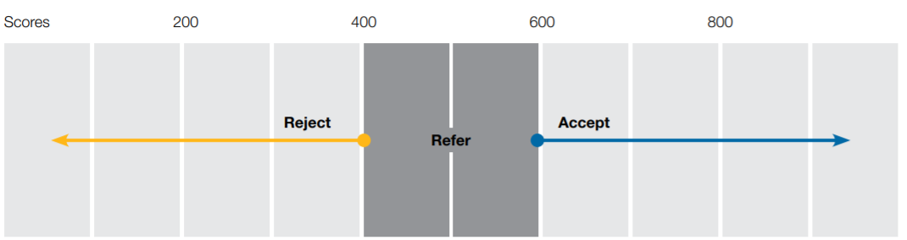

# [Кредитный скоринг по транзакционным данным банка (Transactional Credit Scoring)](#transactional-credit-scoring)
Ссылка на датасет: [link](https://boosters.pro/championship/alfabattle2/data)

- [Кредитный скоринг по транзакционным данным банка (Transactional Credit Scoring)](#transactional-credit-scoring)
  * [Выбор проекта](#select-project)
    + [Преимущества выбранного проекта](#advantages)
    + [Обзор и новостной фон](#review)
  * [Описание датасета](#dataset)
  * [Бизнес и математическая постановки задачи](#business)
  * [Валидация данных и оценка потенциала](#baseline)
  * [Оценка экономического эффекта](#economics)

## [Выбор проекта](#select-project)

В качестве проекта было выбрано создание системы кредитного скоринга банка на основе транзакционных данных клиентов. Основа проекта состоит в объемных данных, которые находятся в открытом доступе в соревновании AlfaBattle 2.0 от Альфа Банка

 

### [Преимущества выбранного проекта](#advantages)

- работа с реальными данными (однако обезличенными);
- работа над реальной жизненной задачей - банковским кредитным скорингом;
- Big Data проект, работа с parquet партициями, объем данных более 3Гб;
- работа с транзауционными данными, последовательностями;
- возможность нейростетевого моделирования транзакционных данных

### [Обзор и новостной фон](#review)

- 💸Россияне взяли рекордное количество кредитов наличными 
  📈 В прошлом месяце россияне взяли рекордное количество нецелевых кредитов, об этом сообщает "Объединенного Кредитного Бюро". По данным бюро, которое располагает информацией о примерно 97% российских заемщиков, выдачи нецелевых кредитов (кредитов "наличными") в июле были рекордными второй месяц подряд. В июле текущего года, как и в июне, россияне взяли 1,7 миллиона кредитов "наличными", на 34% больше, чем в тот же период прошлого 2020 года. За первые семь месяцев 2021 года банки предоставили 10,7 миллиона кредитов. Рост к январю-июлю прошлого 2020 года — 42%.

- 💰 В июле россияне взяли 2,32 миллиона займов «до зарплаты» в микрофинансовых организациях — Национальное бюро кредитных историй.

- 💰 [Россияне на 70% чаще стали брать микрозаймы](https://rg.ru/2021/08/13/rossiiane-na-70-chashche-stali-brat-zajmy-do-zarplaty.html)

- 💰 [Долги россиян по кредитам превысили 2,3 трлн рублей](https://tass.ru/ekonomika/12045281)

- 💰 [Долг населения перед банками составил почти 24 триллиона рублей — данные Центробанка. С начала года показатель вырос на 2,3 триллиона рублей](https://www.rbc.ru/finances/11/08/2021/6112dc5f9a79473a5acea094?fromtg=1.)

Сфера в которой будет реализован проект: Финансы, Финтех, Банкинг
Задача дефолта по кредитным картам, задача транзакционного скоринга

Клиенты банка могут совершать до нескольких тысяч транзакций по платежным картам за год. Банки (внутрибанковский трафик) и платежные системы (межбанковский и внутрибанковский трафик) в свою очередь сохраняют всю историю пользовательских транзакций в своих Data Warehouse. Учитывая то, что все больше людей влезают в долги, не возвращают займы, задача становится все более акутальной и за последние десятилетие уже разработано множество различных инструментов/моделей в банковской сфере.

Задача кредитного скоринга акутальна не только для крупных банков и технологических компаний, таких как Сбер, Яндекс, Тинькофф, и т.д. - лидеров в этой отрасли, но и менее крупных банков, МФО, организаций по выдаче займов, платежных систем и т.д.

В индустрии принято описывать историю усложнения скоринговых моделей в таком порядке:
- Ансамбли, модели на решающих деревьях, градиентном бустинге;
- Модели с использованием нейросетей, моделирование последовательностей, RNN/GRU/LSTM/Attention;
- Модели с использованием графов, графовых нейросетей (GNN), node2vec, графовых эмбеддингов, которые описывают связи между клиентами (пр. переводы)

Задача актуальна, так как такая модель позволит вовремя находить клиентов банка, которые с большей чем threshold вероятностью не вернут деньги, и экономить деньги; или находить платежеспособных клиентов, которым можно одобрять больше кредитов на большие суммы, увеличивая прибыль, и т.д.

## [Описание датасета](#dataset)

Используемый датасет был размещен в ходе соревнования AlfaBattle 2.0 от Альфа Банка на платформе Boosters.
Транзакционные данные клиентов были обезличены и закодированы как категориальные переменные по очевидным причинам.
Датасет приедлагает данные по транзакциям клиентов за весь предшествующий год (12 мес) до даты запроса кредита/займа по какому-то из продуктов банка.

Всего в датасете содержится 450 миллионов транзакций, объемом порядка 6 гигабайт в сжатом формате Apache Parquet. Организаторы разбили датасет на .pq chunk и реализовали методы пакетной предобработки данных, с точки зрения анализа большого массива данных и ограниченности вычислительных ресурсов участников.

В размеченном train датасете содержатся 270 450 065 транзакций 963 811 клиентов, что составляет 2.4GB на диске в сжатом формате .parquet.gzip.

Каждая транзакция клиента представляется в виде набора из 19 фичей:

| Feature | Description | N#unique |
| ----------------- | -------- | -------------------------- |
| currency | Идентификатор валюты транзакции | 11 |
| operation_kind | Идентификатор типа транзакции | 7 |
| card_type | Уникальный идентификатор типа карты | 175 |
| operation_type | Идентификатор типа операции по пластиковой карте | 22 |
| operation_type_group | Идентификатор группы карточных операций, например, дебетовая карта или кредитная карта | 4 |
| ecommerce_flag | Признак электронной коммерции | 3 |
| payment_system | Идентификатор типа платежной системы | 7 |
| income_flag | Признак списания/внесения денежных средств на карту | 3 |
| mcc | Уникальный идентификатор типа торговой точки | 108 |
| country | Идентификатор страны транзакции | 24 |
| city | Идентификатор города транзакции | 163 |
| mcc_category | Идентификатор категории магазина транзакции | 28 |
| day_of_week | День недели, когда транзакция была совершена | 7 |
| hour | Час, когда транзакция была совершена | 24 |
| days_before | Количество дней до даты выдачи кредита | 23 |
| weekofyear | Номер недели в году, когда транзакция была совершена | 53 |
| hour_diff | Количество часов с момента прошлой транзакции для данного клиента | 10 |
| amnt | Нормированная сумма транзакции. 0.0 - соответствует пропускам | inf |

## [Бизнес и математическая постановки задачи](#business)

<b>Бизнес-постановка:</b>
- Как вы будете её измерять?
- Каков критерий успеха?

Цель проекта: улучшить показатели по дефолтам кредитных карт путем заблаговременного определение ненадежных клиентов.
Проект считается успешным, если при внедрении его в работу мы сможем:
 - увеличить прибыль компании
 - увеличить долю возвратов
 - снизить кол-во дефолтов(невозвратов)

<b>Математическая постановка:</b>

Тип задачи машинного обучения: бинарная классификация, обучение с учителем

Оценка условной вероятности ($P={0, 1} | X$) того, что клиент выйдет в дефолт, основываясь на истории потребительского поведения по карточным транзакциям банка.

Метрика: ROC-AUC
- Используется для оценки вероятностных моделей
- Учитывает дисбаланс классов
- Используется в финансах, банкинге наряду с Индексом Джини

## [Валидация данных и оценка потенциала](#baseline)

Оба Jupyter ноутбука можно запустить в режиме "Run All"

Для начала необходимо скачать тренировочные данные с Boosters.pro в zip формате, и распаковать их в папку при помощи команды unzip.
В ноутбуке [eda_validation.ipynb](eda_validation.ipynb) представлены этапы объединения, препроцессинга, валидации датасета.

В первой итерации моделирования используется стратегия кросс-валидации (StratifiedKFold CV), в дальнейшем будет использоваться стратегия разбиения train/valid/test.

В ноутбуке [baseline.ipynb](baseline.ipynb) представлено построение Baseline моделей кредитного скоринга для нескольких продутов банка и их оценка на кросс-валидации CV 5-fold:
- Logistic Regression with StdScaler: Validation CV ROC-AUC Mean = 0.745
- Randon Forest: Validation CV ROC-AUC Mean = 0.744
- Gradient Boosting: Validation CV ROC-AUC Mean = 0.78

Учитывая leaderbord соревнования, ROC-AUC на тестовой выборке может составлять до 0.78 ед на private (значит, что обученные модели на кросс-валидации могли давать AUC 0.79-0.81). Это достигается с использованием улучшенных моделей бустинга, использования нейросетевого подхода (RNN/LSTM), стэкинга/блендинга.

Среди простейших линейных моделей в финансах для задачи классификации чаще используют модель логистической регрессии, которая в нашем случае показала хорошее качество, а также будет иметь преимущество в скорости работы (train/inference).
  
Baseline модель которая показала себе лучше всех на кросс-валидации - Градиентный Бустинг с AUC=0.78, которую в дальнейшем мы и будем развивать и от которой будем отталкиваться.

## [Оценка экономического эффекта](#economics)

Основная цель бизнеса, в т.ч банка, МФО, платежной системы - увеличение прибыли. Есть две основные ситуации, в которых
организации могут оценивать прибыльность:
- Фактическая потеря прибыли от дефолта (средний неплательщик
наверняка частично выплатил бы кредит)
- Потенциал будущей прибыли от повторных займов/кредитов дд "хороших" клиентов
  
  

Case:

Введем дополнительные данные.

Судя по датасету в среднем в дефолт уходит 3% клиентов. Предположим что в случае дефолты мы полностью теряем заемные средства, а в обычном случае мы получаем обратно кредит плюс 10% от него. Таким образом мы создаем ситуацию в которой мы вынуждены минимизировать кол-во ложно отрицательных ответов до тех пор пока проценты по не выданным кредитам не перевесят  кол-во средств которые мы могли бы потерять при дефолте.

  
Таким образом если взглянуть на confusion matrix, то очевидно нам необходимо подобрать такой трешхолд, который бы минимизировал кол-во ложно отрицательных больше чем ложно положительных.

Очевидно, что ROC-AUC никак напрямую не влияет на бизнес-метрики; но увеличивая ROC-AUC мы в целом увеличиваем уверенность ранжирования вероятностей классификатором, тем самым в среднем уменьшая шанс миссклассификации и ошибок I/II рода. Confusion Matrix оценивает один конкретный классификатор с фиксированным порогом, в то время как ROC-AUC оценивает этот классификатор по всем возможным пороговым значениям, но опять в среднем при улучшении метрики AUC, классификатор все точнее распределяет клиентов по группам TP, TN, FP, FN, уменьшая мисскласификацию.

В частности, оценка экономического эффекта заключена в Confusion Matrix. При сравнении двух моделей с двумя AUC и выбранным порогом, возникает экономический Gain:

eta - доля тех кто не вернет среди классифицированных как FN, FP
alpha - коэф, выплата с процентом( пр. 1.1)
Delta2 AUC > Delta1 AUC

Delta1 = Sum_i:N_TP_class{0}_i_1(alpha*Credit_TP_class{0}_i_1) - Sum_i:N_TN_class{0}_i_1(Credit_TN_class{1}_i_1) - eta * Sum_i:N_{FN, FP}_i_1(Credit_{FN, FP}_i_1)

Delta2 = Sum_i:N_TP_class{0}_i_2(alpha*Credit_TP_class{0}_i_2) - Sum_i:N_TN_class{0}_i_2(Credit_TN_class{1}_i_2) - eta * Sum_i:N_{FN, FP}_i_2(Credit_{FN, FP}_i_2)

Gain = |Delta2 - Delta1|

Также, возможно, необходимо учитывать то, что экономический эффект необходимо учитывать и рассчитывать в динамике использования модели.

Необходимо иметь в виду, что отсечение по threshold не обязательно означает принятие
или отклоние заявки. На рисунке ниже \[[1](https://www.cgap.org/sites/default/files/publications/2019_07_Technical_Guide_CreditScore.pdf)\] показан пример, когда компания
может принять клиентов со скором выше 600;
обратиться к ручной оценке заемщиков со скором от 600 до 400; и отклонить
скоры ниже 400.
 

[1] Maria Fernandez Vidal and Fernando Barbon, "How to use advanced analytics to build credit-scoring models that increase access", 2019
